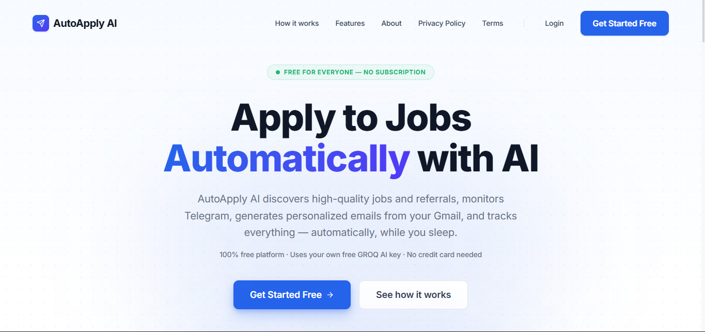
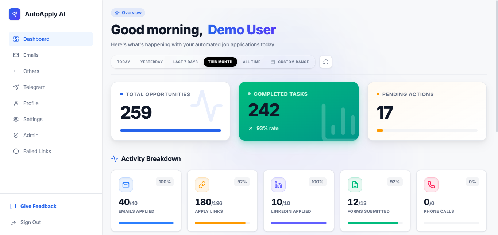

# AutoApply AI

**Apply to jobs automatically, with AI — 100% free, forever.**

🔗 **Live app:** [autoapplyai.duckdns.org](https://autoapplyai.duckdns.org/)

AutoApply AI discovers high-quality jobs and referrals, monitors Telegram job channels, generates personalized application emails from your own Gmail, and tracks every application — automatically, while you sleep.

> 100% free platform · Uses your own free GROQ AI key · No credit card needed

---

## Screenshots

<!-- Drop your screenshot files into a `screenshots/` folder next to this README and they'll render below. -->

**Home Page**

**Dashboard**

---

## About

The internship and job hunt loop — searching, tailoring resumes, tracking applications, following up, repeat — eats hours every week. AutoApply AI was built to take over the repetitive parts of that loop so you can spend your time preparing for interviews instead.

It was built and shipped solo, end-to-end, on a strict self-imposed constraint: **zero infrastructure spend.** Every feature had to survive on free-tier cloud resources — which meant wrestling with OOM kills, DNS/SSL configuration, failed deployments, exploding migrations, crashing workers, and a Google OAuth verification process that became its own side quest along the way.

Today, AutoApply runs entirely on free infrastructure and is live for anyone to use.

## Features

- **Daily Job Discovery** — Discovers high-quality jobs every day from across the web, tailored to your skills.
- **Telegram Import** — Forward job posts directly from Telegram into your dashboard to apply instantly.
- **Application Tracking** — Tracks every application in one unified dashboard with real-time status updates.
- **AI-Powered Emails** — Generates highly personalized application emails using your saved profile and resume.
- **Gmail Automation** — Sends applications automatically from your own Gmail account, so replies land straight in your inbox.
- **LinkedIn Outreach** — Generates personalized LinkedIn connection and outreach messages in one click.
- **Browser Extension** *(prototyped, currently shelved)* — Autofills repetitive application forms and fields across job sites using your profile. Shelved for now since shipping it properly required store verification and ongoing costs that would have broken the "always free" rule. Comeback arc loading.
- **Secure Authentication** — Secured by Clerk and Google OAuth, with encrypted API key storage.
- **Your Key, Your AI** — Uses your own free GROQ API key for AI — no subscription fees, ever.

## How It Works

1. **Connect Telegram** — Link your Telegram account to monitor job channels 24/7, or forward specific job posts directly into AutoApply to track everything in one place.
2. **Add your profile & resume** — Fill in your skills and work experience and upload your resume once. AutoApply uses this to personalize every application it sends.
3. **Add your free GROQ API key** — Grab a free key from [GROQ](https://console.groq.com) in about 60 seconds. This powers all email and message generation — no monthly subscription required.
4. **AutoApply does the rest** — It finds top jobs daily, imports your forwarded posts, generates personalized emails, sends them automatically from Gmail, and tracks every application.

You're up and running in under 10 minutes.

## Tech Stack

| Layer | Technology |
|---|---|
| Backend | FastAPI, PostgreSQL |
| Authentication | Clerk, Google OAuth 2.0 |
| AI / LLM | GROQ API (bring-your-own-key) |
| Automation | Telethon (Telegram API), Playwright (browser automation) |
| Infrastructure | Oracle Cloud Infrastructure (OCI), Linux |
| Browser Extension | Chrome, Manifest V3 *(prototyped, shelved)* |

## Privacy & Google Integration

AutoApply AI only uses Gmail access to send job application emails on your behalf.

- We only use Gmail to send job application emails.
- We do not read your inbox or personal emails.
- We do not sell Google user data.
- We do not use Google user data for advertising.
- We only request the minimum permissions required.
- You can disconnect your Google account at any time.

See the full [Privacy Policy](https://autoapplyai.duckdns.org/privacy) and [Terms & Conditions](https://autoapplyai.duckdns.org/terms) on the live site.

## Pricing

**Free forever. Zero subscriptions. Unlimited applications.**

| | |
|---|---|
| Platform cost | ₹0 forever |
| GROQ API key | Free — no card required |
| Applications | Unlimited |

You only need a free GROQ API key (get one in 60 seconds at [console.groq.com](https://console.groq.com)) to unlock all AI-powered features.

## Getting Started

1. Visit [autoapplyai.duckdns.org](https://autoapplyai.duckdns.org/)
2. Click **Get Started Free** and sign up
3. Connect Telegram and Gmail
4. Add your free GROQ API key
5. Add your profile and resume
6. Let AutoApply do the rest 🚀

## Feedback

This is being built in public — feedback is genuinely welcome. You can leave feedback directly in the app, or reach out on [LinkedIn](https://www.linkedin.com/in/venkata-aditya-gopalapuram-05442626a). Tell me what sucks, suggest features, or just break it.

## Author

Built solo, end-to-end, by **Venkata Aditya Gopalapuram**.

- LinkedIn: [venkata-aditya-gopalapuram](https://www.linkedin.com/in/venkata-aditya-gopalapuram-05442626a)
- GitHub: [VenkataAditya897](https://github.com/VenkataAditya897)

---

© 2026 AutoApply AI · All rights reserved.
